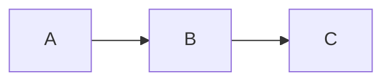

# Visual Design

Create images and presentations.

## Image Generation

Generate images from prompts:
```bash
# Logos
nanobanana generate "company logo" --count=4 --styles=modern,minimal

# Icons
nanobanana icon "settings gear" --style=flat

# Diagrams
nanobanana diagram "auth flow" --type=flowchart
```

## Presentations

Create slides with Slidev:
```bash
# Initialize
npm init slidev@latest

# Dev server
slidev

# Export
slidev export --format pptx
slidev build  # hostable SPA
```

Write slides in markdown:
```markdown
---
# Title Slide

Subtitle here
---

# Content Slide

- Bullet point 1
- Bullet point 2

```ts
const example = "code highlighting"
```
---

# Diagram Slide


```

## Use Cases

- **Architecture diagrams**: system overview
- **Flowcharts**: process documentation
- **Slide decks**: exec presentations, team updates
- **Icons/assets**: UI components
- **Photo edits**: background removal, restoration

## Output

- Images: PNG, SVG
- Presentations: PPTX, PDF, or hostable HTML
